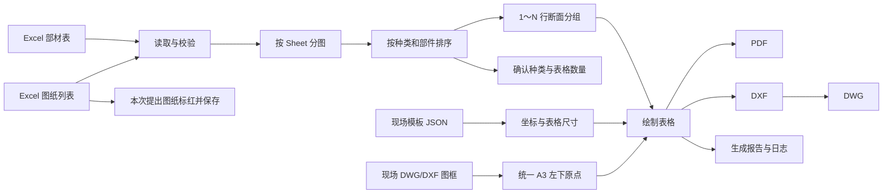

# 部材表图纸生成器：项目开发记录

项目状态：开发中（核心流程已可运行，正式现场样例适配尚未完成）  
记录开始：2026-09-01  
最近更新：2026-09-03

## 一、项目目标

把现场提供的 Excel 部材列表，按楼层 Sheet、部材种类、部件名称和断面记录自动排版到 A3 横向图纸中，输出 PDF；同时保留较高概率会使用的 DXF/DWG 输出。软件应适用于多个现场，并让现场差异尽量通过模板配置解决。

## 二、需求共识

- 一个可见的部材 Sheet 对应一张图纸，文件名默认使用 Sheet 名称。
- Excel 中出现的每个种类分别进入自己的表格；大梁等已配置种类保持既定优先顺序，其他种类也会自动创建表格。
- Excel 每行是一条断面记录。同名部件可能出现 1、2、3、4、5 或更多行，不能限定为“左中右”三行。
- 图纸中同名部件的名称单元格合并，其余字段保留多行。
- 一层的部材必须放在同一张 A3 图纸内；必要时在现场模板允许范围内压缩行高，不自动拆页。
- A3 左下角统一为坐标原点 `(0, 0)`。表格位置由模板中的左边坐标、顶部坐标、列宽、行高和表间距决定。
- 现场 DWG/DXF 图框由用户选择。配置文件只记录本地路径，不把 DWG 内容塞进配置文件。
- 图纸列表放在同一 Excel：A 列图纸名称、B 列图号、C 列起依次为 0、1、2……版提出日期。
- 当最新版本日期等于“本次提出日期”时，必须把该行的图纸名称、图号、最新日期三个单元格标红，并直接保存回原 Excel。
- “本次提出日期”最终固定在哪个单元格尚未确定，因此当前模板保留空配置；明确后直接填写模板即可启用。
- 软件中的 Excel 只读预览，不在当前阶段提供单元格编辑。
- 运行记录保存为日志文件；现场设置自动保留。
- 现场模板按用户输入的名称管理；选择名称不会自动套用，必须点击“读取”。“保存”记录当前界面设置，同名时确认后覆盖更新。
- 提供中文和日文便携版，不要求目标电脑安装 Python，也不修改系统权限。

## 三、阶段记录

### 2026-09-01：阶段一——概念验证

完成：

- 搭建独立 Python 3.12 开发环境和双击启动入口。
- 建立 A3 概念图框、更新履历区、底部信息区、大梁表、小梁表、自由注记区。
- 实现 Excel 多 Sheet 读取、分类、自然排序和 1～N 条同名部件分组。
- 实现名称格合并式绘制，以及 PDF、DXF、DWG 输出。
- 建立读取行数与绘制行数对账、示例 Excel 和基础自动测试。

### 2026-09-02：阶段二——现场工作流

完成：

- 加入本地 DWG/DXF 图框选择、路径配置保留和 LibreDWG 转换。
- 采用 A3 左下原点叠加外部图框，处理 DWG 转换产生的异常句柄。
- CAD 输出升级为 UTF-8 DXF，保留中日文和 `×` 等符号；PDF 使用 CJK 字体渲染。
- 加入“图纸列表”解析：图纸名称、图号、0～N 版日期、最新版本和完整履历。
- 加入原 Excel 条件标红写回；重复执行会替换本软件的旧规则，不无限追加。
- 将下方区域改为只读 Excel 预览，移除界面中的大块运行记录。
- 加入自动保存配置、滚动日志、中文界面和日文界面。
- 制作无需安装 Python 的中日文便携包。
- 修复 Excel 读取失败后界面一直显示“正在读取”的问题；预览改为单次、只读的快速读取，并限制预览范围以避开大量空白格式单元格。
- 将“现场模板文件”改为可输入的模板名称下拉框，加入“读取”和“保存/覆盖更新”，模板保存输出目录、图框路径、排序、输出格式及内部表格配置。
- 模板框为空时自动恢复排序最靠前的名称；软件启动时恢复最后一次真正读取或保存的模板。
- Excel 预览排除日语注音数据，按原工作簿显示合并单元格；内容宽度能放下时隐藏横向滚动条，尾部空白单元格不扩大预览区域。
- Excel 预览改为读取源文件的合并格水平/垂直对齐、字体、字号、换行和行高；合并标题保持源文件居中，并补偿界面字体差异以防换行文字越出边框。
- 取消“大梁/小梁”绘图区域白名单；按每张 Sheet 的实际种类自动创建并排列表格，生成前弹窗确认种类和表格数量。
- 修复日文 DWG 转出 DXF 后的编码异常，不再用西文编码解释日文图框；同时自动重建 LibreDWG 产生的无效 CAD 材质引用。
- 使用当前 `0904` Excel 与现场 DWG 完整验证：2 张图纸的 164/216 行全部对账，PDF、DXF、DWG 三种格式均成功生成。

### 2026-09-03：阶段三——实际图框与数据修正

完成：

- 识别实际 Excel 的合并表头 `梁サイズ`，将其下方连续两列自动映射为“部位”和“断面”，解决只输出部件名称的问题。
- 取消 DWG 转换时强制使用旧版 R2000 DXF；原版本转换后保留现场图框中的 406 个实体，不再生成空图框。
- 自动识别现场 DWG 中比例符合 A3 的最大外框，以左下角为共同原点等比例缩放到 420×297 mm，并清除外框以外的超长辅助轴线。
- 将图框及新增文字统一切换到中日文兼容字体；Excel 中字体不稳定的圆框 B 以 `(B)` 安全显示，原数据中表示方钢管的 `□` 保持不变。
- 表格正文按全页可容纳字号计算，采用倒数第二小的字号作为统一字号，个别特别长的内容才单独缩小；文字与格线之间加入固定留白。
- 用实际 `0904` Excel 和 `図面テンプレート.dwg` 重新验证：2F 164 行、3F 216 行全部读取并绘制，图框、部位、断面均正常显示。
- 适配 `図面テンプレート_テキスト枠.dwg` 中的文字定位标记：`図面名称` 写入 Sheet 名，图纸番号写入右侧空矩形，`R-X` 写入最新版本，作成日写入最新日期。
- 最右侧 `20XX/XX/XX` 作为履历起点，不再附加序号；图纸列表中的日期按版本顺序写入，最早日期在最下面，后续日期每 5 mm 向上排列。
- 表格以 7 mm 为优先单元格高度，空间不足时统一压缩；表名、列表头和正文采用同一个全页字号，解决标题与内容字号差距过大的问题。
- 新图框实际验证：2F 输出 `F-2 / R-7 / 26.03.03`，3F 输出 `F-6 / R-13 / 26.02.18`，日期格式统一为 `YY.MM.DD`。
- 修正窄列长文字越框：CAD 生成后按实际字体包围框二次测量，超出的单元格文字单独缩小，其他内容维持统一字号。
- PDF 默认采用白底黑线的黑白打印策略，不再按 CAD 图层颜色输出绿色、蓝色表格线。
- 图纸番号改为直接替换图框中的 `図面番号` 四个字；其下方矩形不再写入编号。

### 2026-09-04：旧图框兼容与定位回归修正

- DWG 输出先建立临时 R2000 兼容副本，排除旧图框带入的 FIELD/FIELDLIST 等后台对象；不改写原始图框和保留的 DXF。
- 修正旧图框没有 `図面名称` 时整套元数据退回概念图框固定坐标的问题。原图中的 `M5FL 部材リスト` 替换为 Sheet 名，分开的 `R-` 与旧数字替换为当前版本；其余字段使用各自原有文字位置。
- 外部图框的五项定位文字全部校验通过后才写入；缺少、重复或版本数字不能唯一定位时明确报错，不再默默生成错位内容。
- 以实际 0904 Excel 的 3F 数据核对新旧两份 DWG：216 行全部绘制，图名 `3Fリスト`、图号 `F-6`、版本 `R-13`、作成日 `26.02.18` 位于标题栏内。14 次履历无序号，`24.06.19` 在底部。
- 完成旧图框 PDF 全图及右下局部视觉核验；23 项自动测试通过。Excel 和两份输入 DWG 均保持原文件不变；仅修改源代码，未打包。

## 四、项目地图

## 五、当前完成度与后续

| 项目 | 状态 | 说明 |
|---|---|---|
| Excel 读取与多 Sheet | 已完成 | 可见部材 Sheet 一张一图 |
| 1～N 断面与名称合并 | 已完成 | 不限定断面数量 |
| PDF / DXF / DWG | 已完成 | 实际 DWG 图框已完成 A3 归一化和输出验证 |
| 图纸列表版本履历 | 已完成 | 支持 0～N 版 |
| Excel 标红写回 | 功能完成、等待定格 | 等“本次提出日期”准确单元格 |
| 只读 Excel 预览 | 已完成 | 注音、合并格、源对齐/字体/行高与滚动位置已处理 |
| 按种类动态表格 | 已完成 | 生成前逐 Sheet 确认表格数量 |
| 命名现场模板 | 已完成 | 手动读取；保存及确认覆盖；记住最后使用 |
| 中日文便携包 | 已完成 | 正式发布前不设版本号 |
| 正式现场图框适配 | 初步完成 | 图框已正确读入；表格最终坐标、颜色和尺寸仍可继续定稿 |
| 楼层绑定注记 DWG | 下一阶段 | 例如 2～7F、7～8F 使用不同注记 |
| 特殊符号最终方案 | 下一阶段 | 优先 CAD 图形/块，必要时字体回退 |

## 六、版本记录原则

开发阶段暂不设置软件版本号。达到“可用于正式现场的基本功能”后，再从第一个正式版本开始记录软件版本和变更内容。图纸本身的版本仍始终由 Excel 图纸列表管理。

开发交付原则：公司电脑使用 Python 源代码运行。除非用户明确要求，否则日常修改后不重新打包 EXE 或便携包。

## 七、2026-09-04 新确认需求（仅记录，暂不实现）

- 文字长度超出单元格时扩展对应列宽，不再单独缩小该单元格的字体。
- 同一个表格内必须使用相同字号、相同单位行高；不同表格之间不要求全页统一。合并单元格高度必须是单位行高的整数倍。
- 单元格留白大小暂不调整，等待用户实际印刷确认。
- 图纸 list 本身也要打印；全部 PDF 合并输出为一个文件，DWG 仍按图纸分别输出。
- 若扩展列宽后超出 A3 可用区域，处理规则仍待后续确认；不擅自恢复单格缩字或增加分页。
- 本次只用现行生成逻辑测时：原有 2F/3F 共 2 张，以及交替复制 2F/3F、追加 4F～13F 后共 12 张。PDF、DWG、PDF＋DWG 分别实测，不将尚未实现的图纸 list 打印与 PDF 合并算入当前结果。

## 八、2026-09-04 生成耗时实测

本机串行测试，每组 3 次，以下取中位数；每次使用独立生成进程，图框和字体磁盘缓存已经预热。仅测试现行代码，没有实施第七节的新排版、图纸 list 打印、合并 PDF 功能。

| 输出方式 | 原有 2 张、380 行 | 追加后 12 张、2,280 行 |
|---|---:|---:|
| PDF | 10.8 秒 | 79.3 秒 |
| DWG | 1.9 秒 | 11.6 秒 |
| PDF＋DWG | 12.3 秒 | 87.6 秒 |

主要耗时在 PDF 渲染；Excel 读取约 0.016～0.079 秒。全部 18 次计时成功，包含预热的 86 份 PDF 均通过单页 A3 解析检查；抽查了原有 2F 和新增 13F 的实际渲染。原始 Excel 和两份 DWG 输入的文件校验值保持不变。

详细三轮结果、测量口径和限制见 [生成耗时测试记录](C:/Users/62301/Desktop/部材リスト/docs/生成耗时测试_2026-09-04.md)。

## 九、2026-09-04 出图效率优化讨论（待实施）

- 结合实际计时及源码确认：12 张 PDF 的 79.3 秒中约 74.8 秒用于 PDF 渲染，Excel 读取约 0.07 秒，优先优化 PDF 流程。
- 现有原 DWG 转 DXF 已有缓存，PDF＋DWG 已共用中间 CAD 绘制；仍有每页重新解析和绘制图框、把文字转轮廓、DXF 多次读写等可研究的开销。
- 建议先验证“固定矢量图框复用＋动态表格直接绘制 PDF”，两种输出共享排版数据，再考虑变化楼层复用及有限并行。
- 用户可配合固定 Excel 字段位置、图框坐标和唯一定位标记；这些主要提高可靠性，无须为了提速大幅重做 Excel。可选提供同尺度矢量 PDF 空白图框，或由软件首次导入时生成缓存。
- 本次仅整理方案和记录，没有修改功能、输入文件或打包；优化后耗时尚未实测，不承诺具体秒数或倍数。

详细方案见 [出图效率优化方案](C:/Users/62301/Desktop/部材リスト/docs/出图效率优化方案_2026-09-04.md)。

## 十、2026-09-04 DWG 修复与当天排版需求落地

用户反馈：DWG 打开提示修复，修复后部件消失，图框文字显示问号。用户要求停止耗时测试，优先修复，并落实第七节记录的需求；所有文字保留为文字。

处理与依据：

- 实际复现旧输出中的重复编号、重复模型空间/块结束记录，及转换器日志包含 ERROR 但退出码仍为成功的问题。
- 修正导入图层的打印样式引用。原引用可能指向新文档中的字典，导致 CAD 判断为无效数据。
- DWG 兼容流改用日文代码页 CP932，其余字符使用 Unicode 转义；文字样式指定兼容字体及字体族，清除旧大字体引用，不使用问号替代字符。
- 更新项目内 LibreDWG 运行组件至 0.14.8594，核对官方资产 SHA-256，保留旧目录。不安装到系统，不打包生成器。
- 在兼容流中统一重映射转换器保留编号，保留真实模型空间；排除不参与图纸显示但旧格式转换不支持的默认后台对象。
- 生成候选 DWG 后回读：检查错误/警告、原始重复编号、需要修复的对象、文字内容、位置、字号、实体数量和图层引用。失败时不替换已有 DWG，保留 DXF，不再把文件存在当作生成成功。
- PDF 改用嵌入字体的真实文字，仍保留矢量线条。不是截图，也不把文字转成轮廓；缺字时明确报错。

当天排版需求：

- 同一部材表内的表名、列标题、正文采用相同字号；不再单格缩字。默认优先文字高度为 1.2 mm，密集表格受整表单位行高约束。
- 先按统一字号测量最长文字并确定各列所需宽度，再按现场列宽比例分配剩余空间。长文字列加宽，表格仍不越出 A3。
- 同表采用统一单位行高，列标题同样为一单位；名称合并格为 N 倍单位行高，支持 1～N 行。
- 原有每侧水平 0.6 mm、垂直 0.3 mm 留白保持不变，等待实际印刷反馈。
- 图纸 list 打印为 PDF 第一页，保留其内容、合并和对齐；版本日期统一为 YY.MM.DD。楼层页按工作簿顺序接续，全部保存为一个 PDF，DWG 仍分别输出。
- 扩列后若超出 A3 可用宽度，明确提示调整整表设置，不自行缩小个别文字或增加分页。

核验：

- 33 项测试通过，覆盖旧有流程、长文字扩列、统一字号/单位行高、五行合并、原始重复编号检测、转换器“假成功”拦截、中文日文及嵌套块文字回读、单个汇总 PDF、文字不转轮廓。
- 使用实际 0904 Excel，分别配合旧图框和文字标记图框出图，2F 164 行、3F 216 行全部对账。
- 两种图框的 DWG 回读均无转换错误或警告、无重复编号、无需要修复项。2F 为 1,114 个模型空间实体，其中 613 个文字对象；3F 为 1,321 个实体，其中 768 个文字对象。
- 交付的汇总 PDF 共三页：図面リスト、2Fリスト、3Fリスト；三页均为 A3 横向，完成文字提取及逐页渲染检查。
- 原始 Excel 和两份 DWG 的 SHA-256 与修复前一致，未修改输入文件。没有继续做耗时测试。
- 本机未安装用户现场使用的 CAD，尚不能代替现场 CAD 的实际打开验收。已请用户提供 CAD 名称/版本及修复报告，等待新 DWG 的实际打开反馈。

本次核验输出位于 `output/修复核验_20260904`。第七节已落实上述排版与合并 PDF 需求；留白最终尺寸仍待用户反馈。第九节其余性能优化暂缓。

## 十一、2026-09-06 LT 2024 表格文字空白的二次修复

用户实际打开反馈：表格线存在，新增内容全部不见；图框中日文显示问号。上一轮回读检查不足，不能据此认定 LT 实际显示正常。

本轮定位与修改：

- 在上一轮交付的 2F DWG 中，491 段新增文字的插入点仍在单元格里，但真正用于居中定位的第二对齐点全部变成了 `(0, 0)`。上一轮只比较插入点，漏掉了这个关键字段。
- 最小转换实验确认：两个定位点相等时触发转换器问题，不相等则第二对齐点可保留。兼容 DXF 中仅调整居中文字不生效的第一点，保留其真正定位点和对齐方式；不改变内容，不转成轮廓。ALIGNED/FIT 的两个点都有意义，不能套用此处理。
- 保留原图框的 `MS UI Gothic`、`Yu Gothic Light` 等字体定义及大字体，不再全部替换成 `msyh.ttc`。导入兼容流时还原字体族扩展资料，包括原本容易被默认样式覆盖的 Standard。
- 新增文字的 CAD 字体引用与 PDF 的实际字体文件分开。PDF 使用文档副本处理本机字体回退，不修改输出 DWG 的样式。是否被 LT 正确解析仍需现场实际验收；不把本机替代字体的预览当成 CAD 字体显示已确认。
- 严格回读检查新增：第二对齐点、水平/垂直对齐、文字宽度、旋转、字体族与字体文件、大字体、文字/图层显示状态。旧的空白 DWG 现已被检查拒绝。

核验与交付：

- 37 项测试通过，包括真实 DWG 转换的居中/左右对齐、原点及嵌套块文字、字体资料保留、PDF 不修改 CAD、故意破坏定位点或字体/可见性时拦截。
- 实际 0904 Excel 配合两份图框分别重新生成并回读。2F 共 613 个文字对象，其中新增 491 个；3F 共 768 个，其中新增 640 个。新增文字的错误原点对齐数均为 0；文字内容、对齐属性与字体定义对账通过。
- 本次展示的预览从生成后的 DWG 回读结果绘制，不是生成前的 DXF 预览。汇总 PDF 仍为三页：图纸 list、2F、3F；默认黑白，保留文字。
- 新交付文件放在 `output/文字定位修复_20260906`，旧交付文件保留供追查。原始 Excel、两份图框的校验值未改变。没有计时测试，没有打包或系统字体安装。
- 本机没有 AutoCAD LT，无法代替用户在 LT 2024 中打开验收。第一张截图的“外来 DWG 文件”是第三方保存来源提示，本轮不隐藏或伪造此标记。

定位依据：[Autodesk TEXT 对齐点说明](https://help.autodesk.com/cloudhelp/2021/CHS/AutoCAD-DXF/files/GUID-62E5383D-8A14-47B4-BFC4-35824CAE8363.htm)；[Autodesk 第三方 DWG 来源提示说明](https://www.autodesk.com/support/technical/article/caas/sfdcarticles/sfdcarticles/Open-foreign-DWG-file-message-appears-in-AutoCAD.html)。

## 十二、2026-09-09～10 显示兼容性复查与公司源码包

用户反馈：图框文字已正常，LT 2024 中表格仍空白且无错误提示。随后用户用网页 CAD 确认能看到内容，说明数据存在，并要求整理源码 ZIP，遵守公司仅运行源码的限制。

检查得到的事实：

- 第二套独立读取器 ACadSharp 3.7.1 也能找到上一版的表格文字，图层处于显示状态、文字非隐藏；不是 Excel 未读入或文字实体被删除。
- 上一版新增文字的插入点全部是原点，只有第二对齐点在表格位置。网页版可以显示，不代表桌面 LT 的显示/重算链路一定相同。
- 原始 DWG 中 STYLE 的扩展资料引用了 `0x12`，但该位置实际是 DICTIONARYWDFLT，而 ACAD APPID 在另一个位置。转回 DXF 时会重新赋予 ACAD 名称，掩盖了错误引用。不能仅靠 DXF 回读认定字体资料正确。

本轮修正：

- 将 ACAD APPID 映射到转换器实际使用的 `0x12`，搬移原来占用该编号的对象及全部引用，并新增 DWG 原始对象关系检查。
- 新增表格文字使用直接计算的基线左起点，转为普通基线 TEXT；视觉仍按单元格居中/左右对齐，字体大小、行高和内容不变。图框原有对齐方式保留，不再把新增文字基线放在原点。
- 对比转换前后的文字边界，验证定位方式改变未改变视觉位置和文字大小。整个过程不转轮廓、不截图替代文字。
- 两张新 DWG 用 ACadSharp 与兼容 DXF 独立逐项对账：2F 613 个文字对象（新增 491），3F 768 个（新增 640），内容、位置、字号、宽度、对齐方式、图层、可见性一致。新增文字没有原点或隐藏项；该结果仍不是 LT 2024 的实际打开验收。
- 开发目录 42 项测试通过，包含基线位置、视觉边界一致、错误应用对象引用拦截及纯源码模式保护。

源码交付：

- 源码 ZIP 排除 EXE、DLL、PYD、虚拟环境、字体、旧输出和缓存；附代码、模板、现有测试 Excel、DWG/DXF 图框数据、测试和公司运行说明。
- 公司仅批准源码运行时可用 DXF 图框生成 PDF/DXF；直接 DWG 输入/输出依赖独立转换组件，包内不附、不自动下载，需公司另外批准。需要 DWG 可在已有 CAD 中将 DXF 另存。
- 没有转换组件时，首次启动默认不勾选 DWG；误选会在读取或标红 Excel 前停止并说明，不会先写一半输出。
- 环境准备脚本不再固定 `Program Files/Python312`；使用公司提供的 Python，在项目目录创建环境，不提权、不安装 Python、不改系统设置。
- 保留原始 Excel/图框和历史交付以便追查；未继续计时测试，未制作 EXE。新 DWG 核验输出在 `output/LT文字兼容修复_20260910`。
- 源码独立目录核验：未附转换程序，42 项测试中 39 项通过，3 项可选 DWG 集成测试按设计跳过。拦截所有外部转换调用后，用附带 DXF 图框成功生成两层 PDF/DXF，164/216 行对账一致。源码 ZIP 的文件白名单和完整性检查通过。

## 十三、2026-09-10 公司试用反馈与待确认对策

本轮只整理问题和方案，不修改功能，不重新打包。材质符号准确性优先于排版、安装便利性和性能。

1. **材质符号（最高优先级）**：用户将提供通用材质表示规则，可能涉及字母及圆、方框、三角、菱形、星形、五边形、六边形等外框。核查发现当前 `normalized_text` 和出图文字处理确实将两种带方框 B 字符改成 `(B)`，且读取阶段已发生替换；NFKC 规范化也可能改变某些符号。此做法不能保证工程含义，应取消显示内容的擅自替代。建议保留 Excel 原始字符串，将匹配用的规范化键与显示数据分开；通过明确规则生成字母 TEXT 与独立矢量外框，PDF 使用相同符号布局。字母不转轮廓。按整个符号测量列宽，未知符号明确提示，不猜测替换。先确认符号对照样张，再应用整批图纸。规则可共用，现场差异单独覆盖；本轮尚未实现。
2. **DWG 输入和输出**：公司源码包未附原开发目录的原生 DWG 转换程序，所以仅有源码不能直接走现有 DWG 转换链路。当前可用 DXF 图框生成 PDF/DXF，再在公司已有 CAD 中另存 DWG；直接支持 DWG 需公司批准转换组件或另行确认 CAD 集成方式，不绕过公司限制。
3. **图纸 list 与 Sheet 对应**：当前按规范化后的名称精确匹配，不是按图号或模糊匹配；有图纸 list 而楼层 Sheet 找不到对应记录时会停止。建议可增加明确的“对应 Sheet”字段，将展示图名与工作表名分开。只在清单出现、不需要部材表的图纸不应一律视为错误；重复或不明确的对应不能自行猜测。具体 Excel 格式待确认。
4. **缺失日期和记录**：现实现中空版本日期可能回退为界面日期或当天，并作为履历的后备值。建议缺失真实提交记录时保留空白并提示，不自动创造提出履历。日期处理规则待用户后续确定，本轮不定死。
5. **图纸比例与纸张**：用户反馈 DXF 在 CAD 中看起来小，并同时提到 A4 印刷和 A3 输出。暂时保留现有 A3 设定；待确认是 A3 原图缩印 A4，还是改为 A4 原图。需区分 CAD 模型单位、图框归一化和纸面行高；不能只靠屏幕缩放判断实际印刷尺寸。排版细节排在材质符号之后。
6. **环境搭建**：低优先级，后续再讨论简化依赖安装或其他符合公司政策的运行方式；不自动制作 EXE。

下一步需要的素材：材质全称或 Excel 实际写法、输出记号参考、哪个字母被何种外框包围。可提供现有图例 DWG、截图或对照表；不要求用户重新手画全部符号，也不依据口述猜测钢材牌号与记号的对应关系。

## 十四、2026-09-10 固定排版第一版

- 用户要求先精修排版，素材库和大梁拆为多表暂缓；未来素材库试验应与稳定排版版本分开，并重视现有 PDF/DXF 出图效率。本轮没有添加素材库、建立试验分支或重新打包。
- 更正交付边界：公司仅要求源码运行，并没有禁止 DWG 文件。继续保留 DWG 输入输出能力；依赖组件交付另行处理，不应强加用户改用 DXF。
- 原参数为优先字高 1.2 mm、优先行高 7 mm、动态最低行高 2.2 mm；各表按行数和可用区域分别压缩，导致不同表行高、字号不一致。
- 本轮固定所有楼层/种类的单位行高 2.5 mm、字高 1.25 mm；标题、表头、正文相同字号，合并格为整数倍行高，不再自动缩小。配置键为 dynamic_table_layout.fixed_row_height / fixed_text_height；旧模板未配置时同样采用新默认值。
- 选择 2.5 而非 3.5 的依据：现有 3F 大梁 83 行加表头，3.5 mm 需要 294 mm，而区域只有 214 mm；2.5 mm 需要 210 mm。暂不拆表时先采用能容纳现有数据的固定值，待用户看样确认。
- 长文字仍扩列；高度或宽度不足时明确报错，不静默缩字、漏行或分页。保留原水平每侧 0.6 mm 留白和现有定位逻辑。
- 表名统一为“种类名称＋部材リスト”。没有改变材质符号处理；旧带框 B 替换问题仍待专门修复，当前预览仅供排版确认，不能作为无须检查的正式交付版本。
- 43 项测试通过，增加跨种类固定行高/字号、溢出拒绝测试。实际数据 PDF/DXF 输出成功，2F 164 行、3F 216 行对账一致；PDF 汇总三页，渲染检查楼层页。结果在 output/固定排版_20260910；本轮没有做计时测试或 DWG 实际 CAD 打开验收。
- 最终目标是用户只核对 Excel 与符号配置；后续需补齐符号映射、字段对应、缺失数据和输出一致性校验，不能在已知符号问题未解决时保证直接提交甲方。

### 同日反馈：行高与字高比例、CAD 字体与 DWG 交付

- 用户反馈太挤、文字偏位和方框缺字，要求 2.5 倍并补 DWG。按“行高 / 字高 = 2.5”理解，暂不拆表，固定行高 2.5 mm、字高 1.0 mm；不是整张表放大 2.5 倍。
- 列宽仍为最长文字实测宽度加左右各 0.6 mm，再按模板列宽比例分配剩余空间。没有改成等宽。
- 新增文字样式从虚拟文件名 Microsoft YaHei.ttf 改为本机实际选用的字体文件名（本机 msyh.ttc），字体族资料跟随所选字体；减少查看器找不到文件而替代字体的风险。原图框样式不变。截图是否由字体替代造成仍需现场确认，未宣称已验证 LT 显示。
- 43 项测试通过，用原 DWG 图框生成两层 DXF/DWG，164/216 行对账通过，转换回读校验通过；输出 output/排版2_5倍_DWG_20260910。未制作 EXE/ZIP，未修改 Excel。材质带框符号旧问题仍未解决，本版仅用于排版及 CAD 字体验证。

## 十五、2026-09-10～11 基础材质符号试验版

用户明确：以一套基础材质符号规则为起点，不按设计公司分类；以后由用户提供对应材质及自定义符号。块的制作和入库由开发侧承担。先实现普通单一材质，混合材质 BH 待明确表示位置。

排版后续事实补记：已将部件分组改成大小写敏感（sb24a 与 sb24A 分开），并重置从原图框继承的远距离 CAD 初始视图。针对部位列试过轮廓居中，但用户反馈测试文件仍不正确，故该问题仍未验收，不视为已解决。

本轮实现：

- 增加 `material_libraries/base.json`，按用户给出的图例配置 16 个材质名称；`custom.json` 初始为空，支持追加自定义材质及别名，名称冲突会拒绝。无记号是明确规则，不等同空白或未知材质。
- 材质查找只规范化全角英数字、空格和材质牌号字母大小写；部件名称继续大小写敏感。试验版读取后保留单元格原始字符，绘制阶段不再把带框 B 改成括号。普通模式仍保留旧读取流程以便回退。
- 圆和方框记号由可编辑 TEXT 与 LINE/CIRCLE 构成 CAD 块，整份任务复用单位几何，每份图纸复用同外观块定义。新增规则也可使用三角、菱形、五边形、六边形或星形；较大图形超出固定行高时明确提示。
- Excel 材质栏填写完整名称，断面栏填写独立断面尺寸；输出断面列由符号块与断面文字组合，材质列不重复显示。列宽包含符号宽度、0.4 mm 间距和左右各 0.6 mm 留白。
- 整批出图前检查规则、空白材质、未知材质、可显示字符和排版范围；识别已填写的 Web/Flange 分部材质并拒绝按单一材质处理。混合 BH、任意外部 CAD 块导入、自动读图例本次尚未实现。
- 新模式先在任务临时目录完成图纸再发布，逐行记录输入材质、选择规则、块名、位置和规则摘要。DWG 回读新增块引用位置/比例、外框几何、字母及显示状态对账，能拦截偏移块、改变圆半径等问题。
- 提供 `启动材质符号试验版.cmd`，使用已有 Python 环境，窗口带试验标记，首选配置另存。普通入口保留。功能前源码快照在 `backups/材质功能前_20260910`。没有创建 EXE/ZIP；未来源码归档脚本已加入新库和启动入口白名单。
- 更正缺组件提示：说明 DWG 转换组件缺失，不再自行判断公司是否批准 DWG。DWG 输入输出继续保留。

核验与交付：

- 完整回归 62 项通过，含两张 Sheet 的真实 XLSX 格式读取、大小写部件名保留、材质匹配、PDF/DXF 输出和源文件校验值未变。补充混合 BH 拒绝测试后，17 项材质专用测试全部通过。
- 16 种材质的 DWG 实际转换、回读、块数量和文字几何校验通过。对照样张使用两种明确无记号材质及 14 个有符号材质，空圆的两条规则共用块定义。
- 对照样张输出在 `output/材质符号试验_20260911`：PDF、DXF、DWG 和核验报告；PDF 已渲染查看，字母、圆框和方框完整。样张中的“断面寸法”仅示意放置位置，不是工程设计数据。
- 用户原有 Excel 材质栏为空且断面包含旧前缀，因此未猜测并转换其材质；新模式需要用户补充明确材质后再运行实际工程数据。本次没有多 Sheet 性能计时，没有 LT 2024 现场打开验收，不能据此宣称输出已可免检查交付。

操作与配置说明见 `material_libraries/使用说明.md`。下一步以符号样张及现场 CAD 显示反馈为准，再确认复杂自定义符号和混合材质 BH 的表达。

### 2026-09-11 材质功能整合到主界面

- 用户要求集成为一个软件。主界面新增“按材质库生成符号”开关与“材质符号库”按钮；可在同一程序查看基础和自定义规则。
- 开关写入用户首选状态及现场模板的 UI / layout 两处，读取现场模板或重新启动都可恢复；运行时使用该开关决定 Excel 读取和符号绘制方式。旧模板没有设置时默认关闭，避免空材质的旧文件直接进入新模式。
- 取消以环境变量强制材质模式及分开保存设置。旧试验启动文件保留为同一主程序的快捷入口，不再运行另一套界面；旧试验配置目录未删除，主界面使用原程序的配置目录。
- 命令行 `--material-symbols` 同步设置实际生成模板；不受旧试验环境变量影响。
- 隐藏窗口实测通过：切换开关、保存现场模板、切换到旧模板、读取恢复、关闭重开、日语界面与规则列表显示。没有重新打包。

### 2026-09-11 材质符号库改为图形预览

- 根据用户反馈，将规则列表改为“材质全称 / 材质符号”两列，第二列直接显示 CAD 中的字母与外框组合；无记号显示“无”（日语界面为“無”）。
- 预览从出图使用的同一符号块生成，缓存重复外观；仅界面缩略图栅格化，DWG/DXF 输出仍使用可编辑文字和矢量外框。未改变材质映射、出图排版或源 Excel。
- 检查了 16 个基础材质和 5 种自定义多边形预览；两项主界面集成测试通过，覆盖双语列名、符号图片及无记号显示。没有重新打包。

### 2026-09-13 断面按原文输出及双语源码包

- 用户确认不需要断面类型名单或未知断面提示。取消材质预检中的断面前缀限制，`[` 槽钢及自定义写法不再因此终止导出；不自动推断、替换或删除断面中的记号。
- 普通模式与材质模式均原样读取断面字符，取消普通模式对断面全角字符、带框字母和空格的兼容替换。仍保留字体缺字、单行无法容纳换行、排版溢出及材质缺失等独立检查，不宣称任意字符都能由当前字体显示。
- 更新回归测试：原文读取、槽钢与自定义断面 DXF 文字逐项核对、带框文字不做类型拦截、汇总 PDF 使用槽钢测试数据。67 项测试通过；没有新增 AutoCAD LT 实机验收。
- 按用户要求制作中文与日语源码 ZIP，包含材质库及预览模块、现场模板、启动说明和原有 LibreDWG 依赖。生成器不制作 EXE，不包含私人 Excel、DWG 图框、用户配置或历史输出；第三方转换程序按独立依赖明确披露。旧压缩包保留。

### 2026-09-13 第三阶段目标整理（暂不开发）

- 用户将更新追溯和二次对比安排为第三阶段，先等待材质符号验收。验收后保留稳定版本并从独立分支开发；本次仅记录需求，未创建分支、未修改程序或重新打包。
- 颜色以人工来源为准：Excel 表格红字及图框注记可保留红色；其余图框、日期履历和版本等字段不因更新而自动标红。删除不做图面标记，进入删除清单。
- 对比用于发现未周知改动和漏标，不自动改 Excel 的红色。支持修改前后值、整次及单项备注、多个 OneDrive／Teams 等参考链接。
- 控制冗余：结构化快照与生成事件分开、相同数据可复用、受保护记录不清理；不强加内部版本号管理。同一对外版本可多次修正，已提出记录保留，比较基准可切换。
- 详细范围、实施顺序及待定边界见 `docs/第三阶段目标_更新追溯与对比.md`。快照格式、清理数量、重复记录匹配和图框注记识别方式仍待设计确认。
